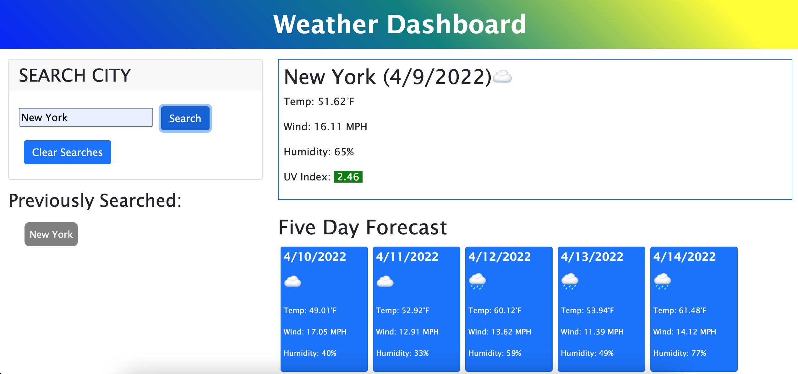
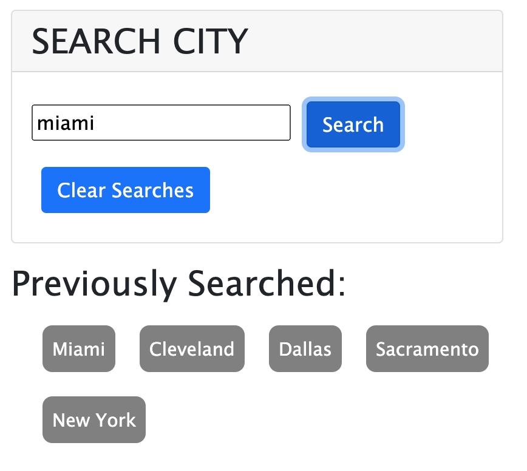

# weather-dashboard

## What Was Asked
AS A traveler

I WANT to see the weather outlook for multiple cities

SO THAT I can plan a trip accordingly

## What Was Done
A user is provided with a search bar to enter a city name

If an acceptable city name is entered then a user is provided with a current forecast as well as a five day forecast

The searched city is then stored to local storage and displayed below

When the user refreshes the page, all previously searched cities are displayed

When the user hits the "Clear Searches" button then all searches are cleared

When the user clicks on one of the previously searched cities then the weather is displayed for that city

## Screenshots of Deployed Application
## Dashboard Overview

## Previously Searched Cities

## Deployed Application URL
https://randronaco1027.github.io/weather-dashboard/ 